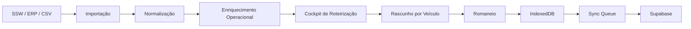

# Router

**Plataforma offline-first para roteirização operacional, expedição e governança de entregas fracionadas.**

O **Router** é um sistema de apoio à decisão para operações de transporte rodoviário, criado para transformar dados brutos de TMS/ERP em uma visão operacional clara para montagem de rotas, controle de frota, priorização de CTRCs e emissão de romaneios.

> Objetivo central: ajudar a operação a reduzir sobras, proteger cargas críticas e sustentar uma meta operacional de entregas realizadas no dia.

---

## Sumário

- [Visão Geral](#visão-geral)
- [Problema que o Router resolve](#problema-que-o-router-resolve)
- [Principais recursos](#principais-recursos)
- [Arquitetura](#arquitetura)
- [Stack Tecnológica](#stack-tecnológica)
- [Fluxo Operacional](#fluxo-operacional)
- [Estrutura do Projeto](#estrutura-do-projeto)
- [Modelo de Dados](#modelo-de-dados)
- [Como Rodar Localmente](#como-rodar-localmente)
- [Scripts Disponíveis](#scripts-disponíveis)
- [Status do Projeto](#status-do-projeto)
- [Roadmap](#roadmap)
- [Documentação Técnica](#documentação-técnica)

---

## Visão Geral

O Router atua na etapa tática da operação logística: a montagem diária de rotas e romaneios.

Ele importa cargas pendentes, normaliza os dados, enriquece cada CTRC com informações operacionais e permite ao usuário montar rascunhos de carregamento por veículo, com apoio visual para capacidade, SLA, ocorrência, localização, Curva A, FOB e agrupamentos de rota.

A proposta do sistema é unir:

- **velocidade de decisão operacional**;
- **resiliência offline/local-first**;
- **organização de dados críticos**;
- **controle de frota e capacidade**;
- **base evolutiva para roteirização automática**.

---

## Problema que o Router resolve

Operações de transporte fracionado sofrem quando a roteirização depende de análise manual, planilhas dispersas ou sistemas lentos em momentos críticos.

Os principais riscos operacionais são:

| Risco | Impacto |
|---|---|
| Carga crítica esquecida | Atraso, retrabalho e perda de nível de serviço |
| Falta de visão por cidade/rota | Montagem imprecisa dos romaneios |
| Excesso de dependência da nuvem | Lentidão ou parada em momentos de expedição |
| Capacidade de veículo mal validada | Risco de excesso de peso ou replanejamento |
| Falta de histórico estruturado | Decisões repetidas sem aprendizado operacional |
| Uso não controlado de agregados | Aumento do custo operacional |

O Router busca reduzir esses riscos com uma interface focada na operação real de doca, pátio e expedição.

---

## Principais recursos

### Importação e normalização

- Importação de arquivos CSV/TXT vindos de ERP/TMS.
- Mapeamento flexível de colunas.
- Detecção de cabeçalho e delimitador.
- Persistência do layout de importação.
- Conversão de dados brutos em objetos operacionais de CTRC.

### Enriquecimento operacional

Cada CTRC pode ser enriquecido com:

- cidade normalizada;
- setor/rota;
- SLA de entrega;
- status de peso;
- ocorrência e criticidade;
- localização física;
- identificação de Curva A;
- identificação de FOB;
- flags visuais para tomada de decisão.

### Cockpit de roteirização

- Listagem operacional de cargas pendentes.
- Filtros por unidade, rota, localização, prioridade e busca textual.
- Agrupamento por rota/cidade/setor.
- Seleção múltipla de CTRCs.
- Rascunho de alocação por veículo.
- Indicador de veículo recomendado por compatibilidade de carga.
- Validação visual de capacidade.

### Frota e romaneios

- Cadastro local de veículos.
- Controle de status de frota.
- Alocação temporária de cargas.
- Emissão/consolidação de romaneio.
- Persistência local de registros.
- Preparação para sincronização em nuvem.

### Persistência offline

- Banco local no navegador via IndexedDB.
- Repositórios isolados por domínio.
- Base local para CTRCs, veículos, motoristas, cidades, ocorrências, Curva A e romaneios.
- Operação resiliente mesmo com instabilidade de rede.

---

## Arquitetura

O Router segue uma filosofia **Offline-First / Local-First**.

A operação imediata acontece no cliente, usando persistência local e processamento em memória. A nuvem é usada como camada de sincronização, consolidação e persistência central, mas não como dependência crítica para a execução tática do dia.



### Princípios arquiteturais

| Princípio | Aplicação |
|---|---|
| Offline-first | A operação não deve parar por falha de rede |
| Local-first | Filtros, agrupamentos e rascunhos rodam localmente |
| Separação por domínio | Componentes, hooks, services e repositories isolados |
| Sincronização eventual | Dados locais podem ser enviados à nuvem em segundo plano |
| Explicabilidade operacional | Toda sugestão deve ser compreensível para o usuário |
| Evolução incremental | O sistema começa assistivo e evolui para sugestão automática |

---

## Stack Tecnológica

| Camada | Tecnologia |
|---|---|
| Frontend | React 19 |
| Linguagem | TypeScript |
| Build | Vite |
| Estilização | Tailwind CSS |
| UI/Ícones/Animações | Lucide React, Motion |
| Persistência local | IndexedDB |
| Wrapper IndexedDB | Dexie.js |
| Backend local | Express |
| Cloud backend | Supabase |
| IA / Integração futura | Google GenAI SDK |

---

## Fluxo Operacional

```text
1. Exportação do relatório operacional no sistema fonte
2. Importação do arquivo no Router
3. Mapeamento das colunas do arquivo
4. Normalização de cidades, rotas e dados logísticos
5. Enriquecimento dos CTRCs com SLA, ocorrência, peso, Curva A e FOB
6. Filtro e agrupamento das cargas no cockpit
7. Seleção de cargas pelo operador
8. Sugestão/validação de veículo
9. Geração de rascunho
10. Consolidação do romaneio
11. Persistência local
12. Sincronização futura com nuvem
```

---

## Estrutura do Projeto

```text
src/
├── components/
│   ├── roteirizacao/
│   │   ├── helpers/
│   │   │   ├── getOcorrenciaStatus.ts
│   │   │   ├── getPesoStatus.ts
│   │   │   ├── getSlaStatus.ts
│   │   │   └── isClienteCurvaA.ts
│   │   ├── hooks/
│   │   │   ├── useCargaSelection.ts
│   │   │   ├── useRoteirizacaoFilters.ts
│   │   │   ├── useRoteirizacaoGrouping.ts
│   │   │   └── useVehicleAllocation.ts
│   │   ├── services/
│   │   │   └── roteirizacaoEnrichmentService.ts
│   │   ├── CargaGroup.tsx
│   │   ├── CargaItem.tsx
│   │   ├── CargaList.tsx
│   │   ├── ConsolidacaoDrawer.tsx
│   │   ├── RoteirizacaoHeader.tsx
│   │   ├── RoteirizacaoView.tsx
│   │   ├── SelectionSummary.tsx
│   │   └── VehicleCard.tsx
│   ├── ImportacaoView.tsx
│   ├── FrotaView.tsx
│   ├── FinalizacaoView.tsx
│   ├── ConfiguracoesView.tsx
│   └── ...
├── infrastructure/
│   └── localdb/
│       ├── repositories/
│       │   ├── ctrcRepository.ts
│       │   ├── vehicleRepository.ts
│       │   ├── driverRepository.ts
│       │   ├── occurrenceRepository.ts
│       │   ├── cidadeRotaRepository.ts
│       │   ├── curvaAClientRepository.ts
│       │   ├── helperRepository.ts
│       │   ├── syncQueueRepository.ts
│       │   └── userPreferenceRepository.ts
│       └── db.ts
├── data.ts
├── supabase.ts
├── types.ts
└── App.tsx
```

---

## Modelo de Dados

### CTRC

Representa uma carga/documento operacional pendente ou em roteirização.

Campos relevantes:

- identificador do CTRC;
- destinatário;
- cidade de entrega;
- setor/rota;
- peso real;
- quantidade de volumes;
- previsão de entrega;
- remetente;
- pagador;
- nota fiscal;
- valor da mercadoria;
- valor do frete;
- ocorrência;
- localização física;
- status operacional.

### RoteirizacaoItem

Extensão enriquecida do CTRC usada no cockpit de roteirização.

Inclui:

- cidade normalizada;
- rota normalizada;
- prazo padrão;
- prioridade operacional;
- status de SLA;
- status de peso;
- criticidade de ocorrência;
- status de disponibilidade;
- indicador de Curva A;
- indicador FOB;
- flags visuais para UI.

### Vehicle

Representa um veículo disponível para montagem de rota.

Campos atuais:

- placa;
- motorista;
- capacidade;
- tipo;
- status.

Campos planejados:

- próprio/agregado;
- custo fixo;
- custo por endereço;
- cidades preferenciais;
- cidades restritas;
- necessidade de ajudante;
- eficiência operacional;
- observações.

---

## Como Rodar Localmente

### Pré-requisitos

- Node.js 18 ou superior
- npm
- Navegador moderno com suporte a IndexedDB

### 1. Instalar dependências

```bash
npm install
```

### 2. Configurar variáveis de ambiente

Crie um arquivo `.env` na raiz do projeto:

```env
VITE_SUPABASE_URL=sua-url-do-supabase
VITE_SUPABASE_ANON_KEY=sua-chave-anonima-do-supabase
```

### 3. Rodar em desenvolvimento

```bash
npm run dev
```

A aplicação ficará disponível em:

```text
http://localhost:3000
```

### 4. Gerar build de produção

```bash
npm run build
```

### 5. Executar build

```bash
npm start
```

---

## Scripts Disponíveis

| Script | Descrição |
|---|---|
| `npm run dev` | Inicia o servidor de desenvolvimento com `tsx server.ts` |
| `npm run build` | Gera build Vite e empacota o servidor com esbuild |
| `npm start` | Executa o servidor compilado |
| `npm run preview` | Executa preview do Vite |
| `npm run clean` | Remove arquivos de build |
| `npm run lint` | Executa checagem TypeScript sem emitir build |

---

## Status do Projeto

| Área | Status |
|---|---|
| Importação de cargas | Operacional |
| Persistência local IndexedDB | Operacional |
| Enriquecimento de CTRCs | Operacional |
| Cockpit de roteirização | Operacional |
| Alocação por veículo | Operacional assistiva |
| Romaneio/finalização | Em consolidação |
| Sincronização com Supabase | Em amadurecimento |
| Sugestão automática de rotas | Planejado |
| Sequenciamento interno de entregas | Planejado |
| Controle avançado de custo de agregados | Planejado |

---

## Roadmap

### Fase 1 — Base operacional

- Melhorar contratos de domínio.
- Formalizar veículos próprios/agregados.
- Criar prioridade operacional P0/P1/P2/P3.
- Adicionar cálculo de custo de agregados.
- Adicionar risco de próxima oportunidade de entrega.

### Fase 2 — Sugestão de roteirização

- Sugerir alocação de cargas por veículo.
- Considerar capacidade, cidade, prioridade e custo.
- Exibir justificativa da recomendação.
- Alertar cargas críticas fora do rascunho.

### Fase 3 — Sequenciamento

- Ordenar entregas dentro da rota.
- Considerar janela de entrega/agendamento.
- Agrupar destinatários repetidos.
- Reduzir zigue-zague operacional.

### Fase 4 — Torre operacional

- Medir execução diária.
- Comparar planejado x realizado.
- Acompanhar produtividade por motorista/rota.
- Retroalimentar o algoritmo com histórico.

---

## Documentação Técnica

Documentos recomendados para evolução do projeto:

| Documento | Objetivo |
|---|---|
| `README.md` | Visão geral, instalação e arquitetura do projeto |
| `SPEC.md` | Regras de negócio, decisões operacionais e critérios de aceite |
| `CHANGELOG.md` | Histórico de mudanças |
| `CONTRIBUTING.md` | Padrão de contribuição e fluxo de desenvolvimento |

---

## Convenções de Desenvolvimento

Recomendações para manter o projeto escalável:

- manter regras de negócio fora dos componentes visuais;
- criar services puros para cálculo operacional;
- preservar hooks apenas para estado e interação de UI;
- manter repositories isolados da interface;
- evitar duplicação de parsing de capacidade, peso, SLA e ocorrência;
- documentar decisões operacionais no `SPEC.md`;
- escrever regras críticas com testes unitários quando o motor de roteirização for implementado.

---

## Filosofia do Produto

O Router não é apenas uma tela para distribuir cargas.

Ele deve funcionar como uma camada de inteligência operacional entre os dados brutos do TMS e a decisão real da expedição, ajudando o usuário a enxergar:

- o que precisa sair;
- por que precisa sair;
- qual veículo faz mais sentido;
- qual risco permanece;
- qual decisão protege melhor a operação.

A prioridade do produto é ser simples, rápido, resiliente e útil no momento em que a operação está sob pressão.
